<h1 align="center">Hi 👋, I'm Hamad</h1>
<h3 align="center">🐧 Linux & Homelab Enthusiast | 💻 Developer in Dubai, UAE</h3>

  

---

### 🚀 About Me
- 🏡 Passionate about building and managing **homelabs, servers, and self-hosted systems** 
- 🐧 Exploring **Linux**, open-source tools, and modern tech stacks  
- ☕ Coffee fuels my late-night coding sessions  
- 💡 Always curious, learning, and sharing knowledge with the dev community  

---

### 🌱 Currently Learning 
- Linux administration and server orchestration  
- Expanding my backend knowledge 

---

### 🤝 Let’s Collaborate
- Self-hosted projects & homelabs  
- Workflow automation and DevOps experiments  
- Open-source contributions  

---

### 📫 Contact Me
- Email: **nhamad919@gmail.com**  
- LinkedIn: [hamadnoor](https://linkedin.com/in/hn04)  
---

### 💻 Languages & Tools

---

### 📊 Stats

  

  

  

  

